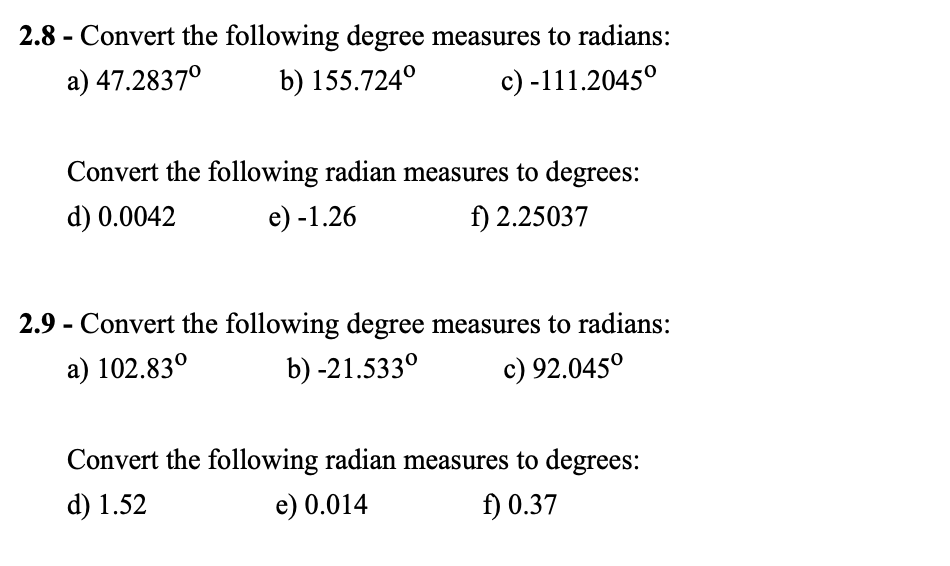
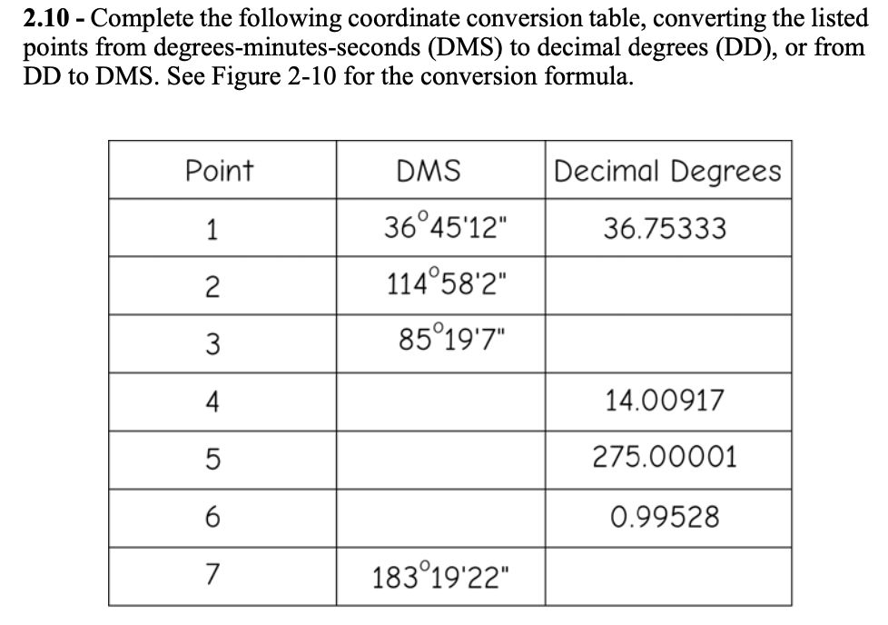

In this week, we will cover the following topics:

**Theoretical topics**:

What are the most important characteristics of geographic data?

How are geographic data transformed into information?

What conceptual models are used to represent geographic objects and phenomena

What are the most commonly used data structures and formats?

## 👨‍🏫 Lecture Slides 

You can find the slides [here](slides.qmd)

## **Practical exercises**

Follow [these instructions](https://drive.google.com/file/d/1Rg52rbJTiantbiTvrh2apyuS6UPpaj4R/view?usp=sharing) to extract features and change their symbology. 

## 📚 Recommended Reading 

Read [this document](https://drive.google.com/file/d/14xeh1vla7unSIxlh7DCbBzc7QlujyDh0/view?usp=drive_link) and take notes

## ✍️ Coursework

🚧 In your  notebook,  answer the following questions 🚧

### Question 1
::: {.callout-important collapse=true}

:::

### Question 2
::: {.callout-important collapse=true}

:::

