# Non spatial joins

## Goal

To join a population table to a municipalities geopackage

<figure>
    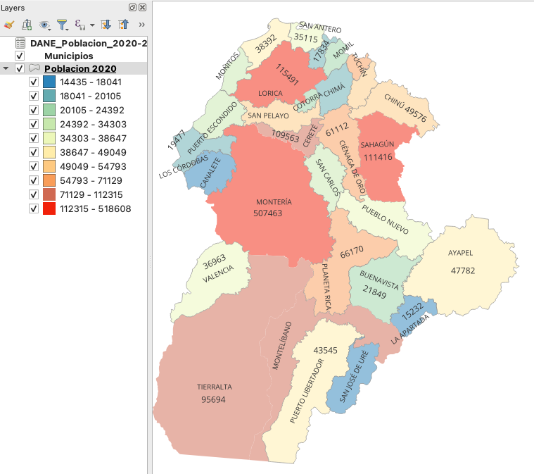
</figure>

## DANE population table

Download *Proyecciones de población DANE*

<figure>
    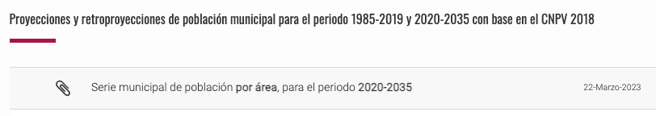
</figure>

## Original table

*DCD-area-proypoblacion-Mun-2020-2035-ActPostCOVID-19.xlsx*

 <figure>
    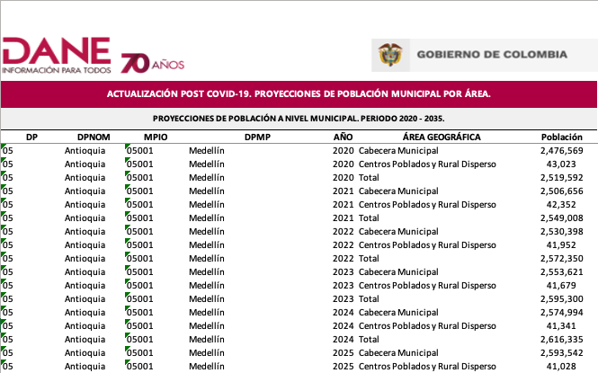
</figure>

## Edited table

DANE table after going from *long* to *wide* format:

<figure>
    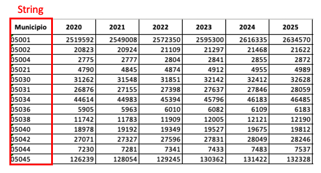
</figure>

# Joining two tables in QGIS

To join two tables, a common attribute is needed. While *their names* don't matter, their *data types* do!

## Edited Municipalities table

Cordoba municipalities table *after deleting several fields*

<figure>
    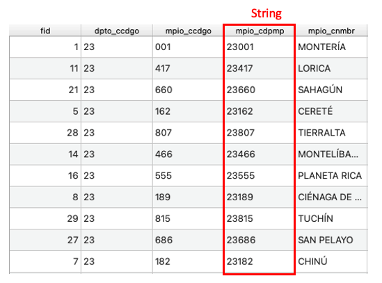
</figure>

## Joins in QGIS [1]

Go to *Municipalities* Layer Properties:

<figure>
    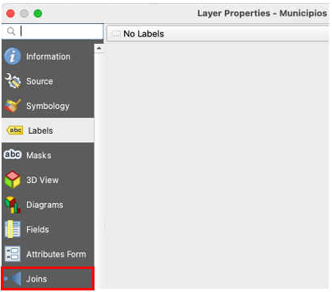
</figure>

## Joins in QGIS [2]

Execute this procedure: 

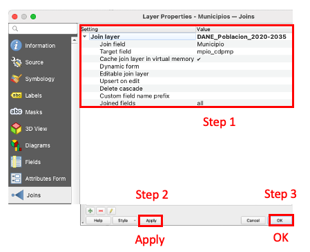

## Result

Open the municipalities attribute table:

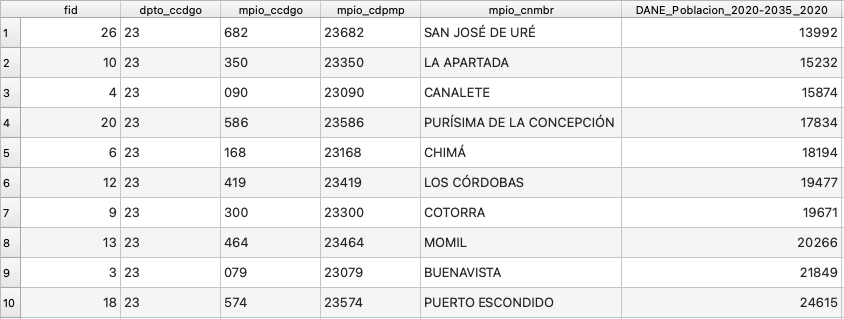

## Goal accomplished! 

Visualization of 2020 population per municipality (and OSM background):

<figure>
    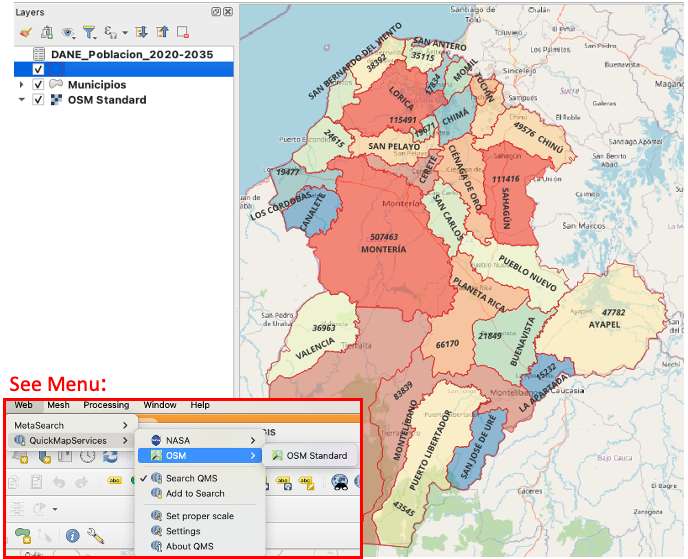
</figure>

# Poverty Mapping

## Monetary poverty

Poverty is about not having enough money to meet basic needs including food, clothing and shelter.  However, poverty is more, much more than just not having enough money (Economic and social inclusion Corporation).

## Multidimensional poverty

Poverty is *hunger*. Poverty is *lack of shelter*. Poverty is *being sick and not being able to see a doctor*. Poverty is *not having access to school and not knowing how to read*. Poverty is *not having a job*, is *fear for the future*, *living one day at a time* (WB).

## Poverty Atlas - US$2.15

<figure>
    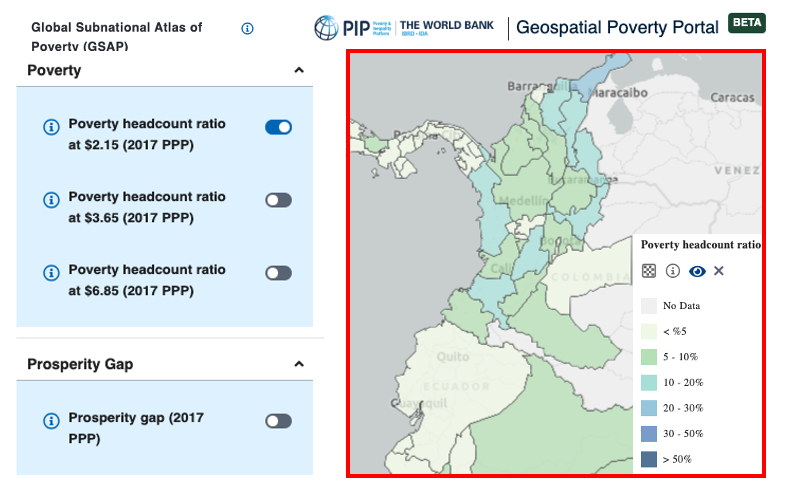
</figure>

## Poverty Atlas - US$3.65

<figure>
    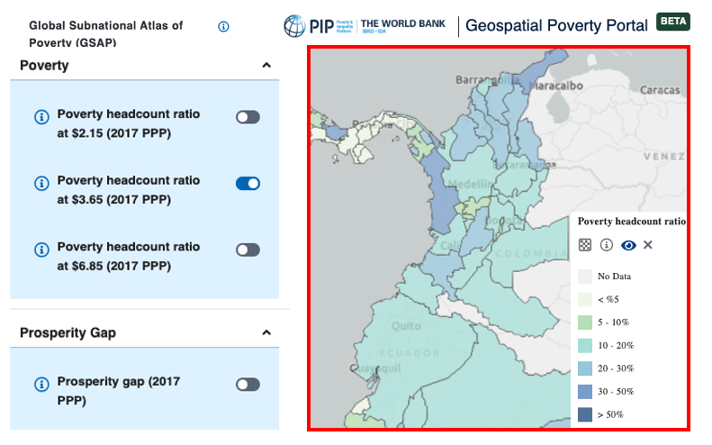
</figure>

## Poverty Atlas - US$6.85

<figure>
    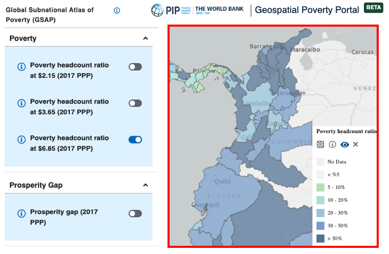
</figure>

# IPM practical exercise 

## Goal

To obtain  a multidimensional poverty's shapefile and produce a meaningful & appealing map for our department

<figure>
    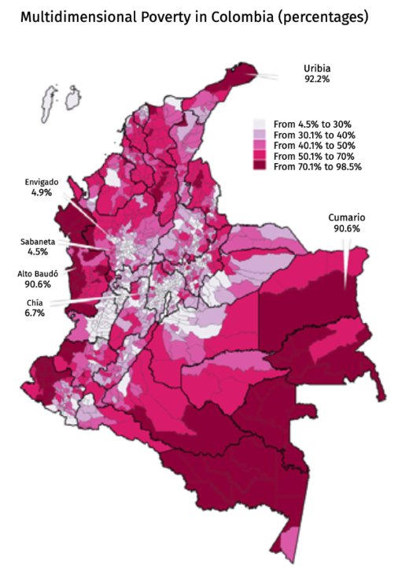
</figure>

## Indice de Pobreza Multidimensional (IPM)

Download shapefile of 2018 IPM from  [DANE](https://dane.maps.arcgis.com/apps/MapJournal/index.html?appid=54595086fdd74b6c9effd2fb8a9500dc)

<figure>
    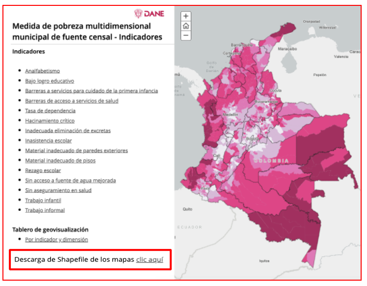
</figure>

##  Download compressed file

<figure>
    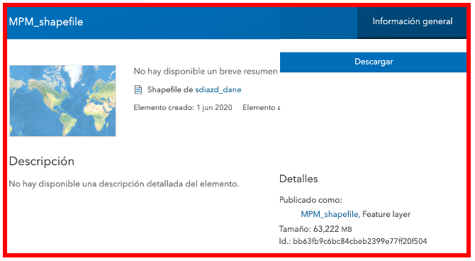
</figure>

## Extract and check data dictionary

<figure>
    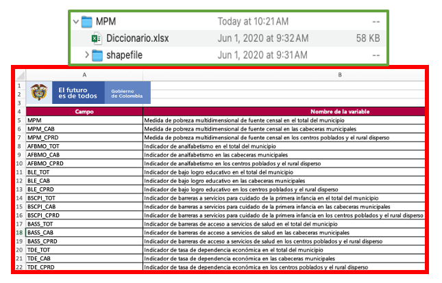
</figure>

## Reading & Visualizating the shapefile  

<figure>
    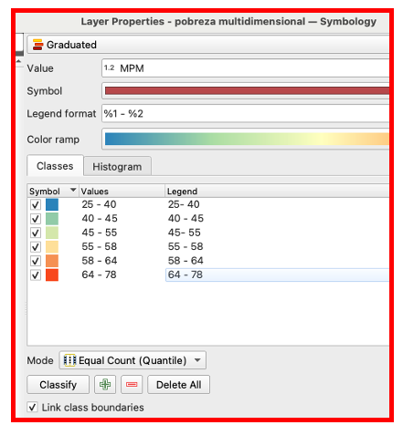
</figure>

## Mapping multidimensional poverty

Create an IPM visualization similar to this one:

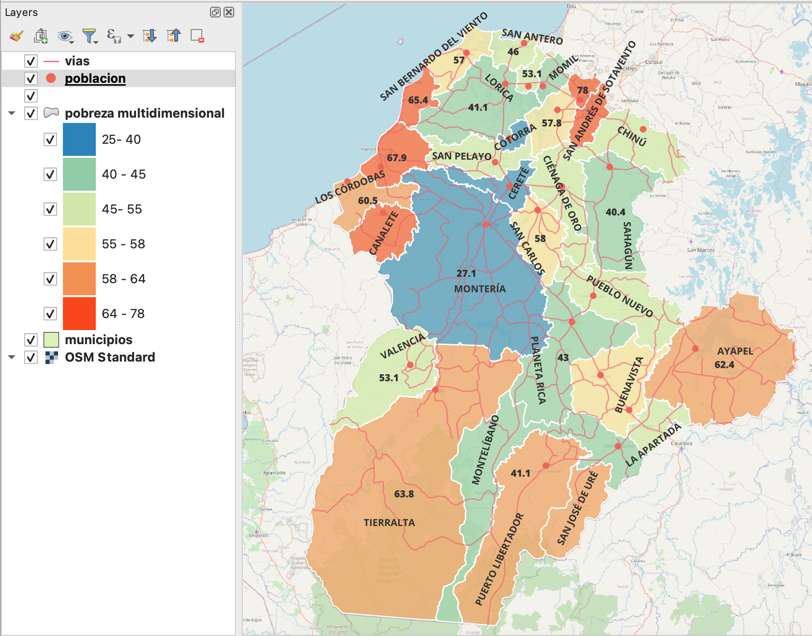

## Mapping cities' population

Create a population visualization similar to this one:

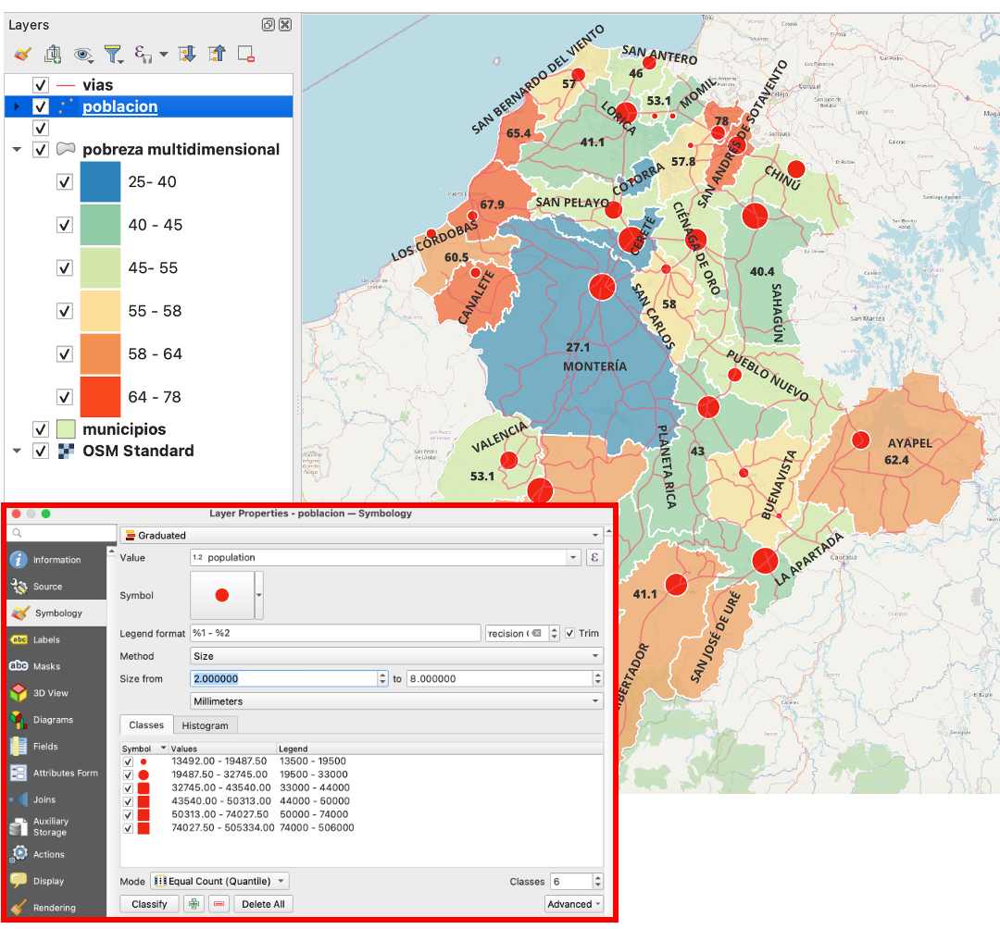

## Make your socioeconomic map(s)

Create a PDF with such your socioeconomic map a bring it to the classroom on 7th October.

